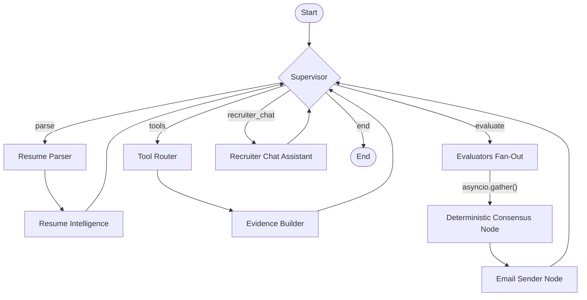

# AI Recruitment Operating System

An advanced AI-driven recruitment agentic workflow system built on **FastAPI**, **LangGraph**, and **MongoDB**. The system automates candidate resume parsing, extracts links for background verification, executes verification tools in parallel, evaluates candidate skills and matching tiers, and supports recruiter chat operations.

---

## ✨ Key Features & User Roles

### 👥 Dual User Roles
The application is designed for two distinct types of users, offering a seamless experience tailored to their needs:

1. **HR / Hiring Manager (Recruiter View)**:
   - **Dashboard**: Managers can log in to view active job postings and manage the candidate pipeline.
   - **Create Jobs**: Managers can create detailed job descriptions specifying required skills, experience, and job requirements.
   - **Evaluate Candidates**: Review deep AI-generated evaluations of candidates, combining resume parses with external validations (like checking GitHub activity or portfolios).
   - **AI Chat Assistant**: Directly interact with a specialized AI agent to drill down into a candidate's profile or take immediate actions.

2. **Candidate (Applicant View)**:
   - **Apply for Jobs**: Candidates can browse open positions and apply.
   - **Resume Upload & Parsing**: Candidates can upload their resumes (PDF format). The system automatically parses these to extract skills, work history, and external links for background verification.

### 💬 Intelligent Recruiter Chat (ReAct Agent)
The recruiter chat feature goes beyond a simple Q&A bot—it functions as a LangGraph-powered **ReAct (Reasoning + Acting) Agent**:
- **Context Awareness**: It understands which candidate and job you are currently reviewing by fetching the latest evaluation results and background checks from MongoDB on the fly.
- **Action Execution (Tools)**: Armed with the `EmailTool` (Gmail API integration), the agent can autonomously draft and send emails to candidates directly from the chat interface—perfect for instantly scheduling an interview or sending status updates!
- **Decision Support**: It assists recruiters by quickly summarizing dense technical evaluations, comparing candidate skills directly against job prerequisites, and highlighting any "red flags" discovered during the verification phase.

---

## 🏗️ Architecture & LangGraph Workflow

The project uses a centralized **Orchestrator/Supervisor** pattern using LangGraph. The `supervisor` node inspects the execution state and routes the candidate through specialized agent nodes.

### Workflow Diagram



**Inside `evaluators_fan_out`** (runs concurrently via `asyncio.gather`):
- `technical_evaluator_node` → Acts like a Senior Engineer, evaluates coding depth
- `verification_evaluator_node` → Acts like an Auditor, checks timeline & authenticity
- `job_matching_evaluator_node` → Acts like a Hiring Manager, maps skills to job requirements

---

## 📂 Codebase Directory & File Structure

### Root Files
| File | Purpose |
|------|---------|
| [.env](file:///c:/Users/VICTUS/Desktop/redrobai/.env) | Environment variables (API keys, MongoDB URI, email config) |
| [README.md](file:///c:/Users/VICTUS/Desktop/redrobai/README.md) | This documentation file |

### `backend/` — Core Application

| File | Purpose |
|------|---------|
| [main.py](file:///c:/Users/VICTUS/Desktop/redrobai/backend/main.py) | FastAPI entrypoint. MongoDB lifespan, `/evaluate` and `/chat` endpoints, Uvicorn server. |
| [config.py](file:///c:/Users/VICTUS/Desktop/redrobai/backend/config.py) | Pydantic Settings. Auto-loads `.env`. Exposes `settings` singleton for all modules. |
| [models.py](file:///c:/Users/VICTUS/Desktop/redrobai/backend/models.py) | Pydantic schemas: `Candidate`, `Job`, `Evidence`, `TechnicalEvaluation`, `VerificationEvaluation`, `JobMatchEvaluation`, `Ranking`. |
| [prompts.py](file:///c:/Users/VICTUS/Desktop/redrobai/backend/prompts.py) | System prompt templates for all AI agent nodes. |
| [verify.py](file:///c:/Users/VICTUS/Desktop/redrobai/backend/verify.py) | Smoke test script. Imports all modules, compiles the graph, prints ASCII connectivity. |
| [requirements.txt](file:///c:/Users/VICTUS/Desktop/redrobai/backend/requirements.txt) | Python dependencies: `fastapi`, `langgraph`, `motor`, `google-generativeai`, `groq`, `httpx`, `pypdf`. |

### `backend/services/` — Service Layer

| File | Purpose |
|------|---------|
| [database.py](file:///c:/Users/VICTUS/Desktop/redrobai/backend/services/database.py) | Async MongoDB CRUD using `motor`. Save/fetch `Candidate`, `Job`, `Evidence`, `Ranking`. |
| [llm.py](file:///c:/Users/VICTUS/Desktop/redrobai/backend/services/llm.py) | LLM routing: `GeminiProvider` + `GroqProvider` with key rotation, exponential backoff, and automatic fallback. Exposes `LLMService` singleton. |

### `backend/graph/` — LangGraph Workflow

| File | Purpose |
|------|---------|
| [state.py](file:///c:/Users/VICTUS/Desktop/redrobai/backend/graph/state.py) | `GraphState` TypedDict — shared state across all workflow nodes. |
| [workflow.py](file:///c:/Users/VICTUS/Desktop/redrobai/backend/graph/workflow.py) | All node functions + graph compilation. Supervisor routing, linear parsing, tool execution, concurrent evaluation, deterministic consensus scoring, email notification, recruiter chat. |

### `backend/tools/` — Independent Verification Tools

Each tool is a standalone class extending `BaseTool`. Tools have **zero knowledge of each other** and are executed by the `evidence_builder` node.

| File | Class | API Used | Purpose |
|------|-------|----------|---------|
| [base.py](file:///c:/Users/VICTUS/Desktop/redrobai/backend/tools/base.py) | `BaseTool` | — | Abstract base class with `run()` interface. |
| [github.py](file:///c:/Users/VICTUS/Desktop/redrobai/backend/tools/github.py) | `GitHubTool` | GitHub REST API v3 | Fetches user profile, repos, stars, contribution stats. Uses `GITHUB_TOKEN`. |
| [search.py](file:///c:/Users/VICTUS/Desktop/redrobai/backend/tools/search.py) | `SearchTool` | Tavily API + DuckDuckGo fallback | Web search for coding profiles, publications, awards. Uses `TAVILY_API_KEY`. |
| [website.py](file:///c:/Users/VICTUS/Desktop/redrobai/backend/tools/website.py) | `WebsiteTool` | HTTP scraping | Fetches and cleans text from candidate portfolio/blog URLs. |
| [youtube.py](file:///c:/Users/VICTUS/Desktop/redrobai/backend/tools/youtube.py) | `YouTubeTool` | YouTube oEmbed API | Fetches video metadata (title, channel) from demo video links. |
| [drive.py](file:///c:/Users/VICTUS/Desktop/redrobai/backend/tools/drive.py) | `DriveTool` | Google Drive public download | Extracts file ID from Drive links, retrieves file metadata. |
| [google_docs.py](file:///c:/Users/VICTUS/Desktop/redrobai/backend/tools/google_docs.py) | `GoogleDocsTool` | Google Docs export endpoint | Exports public Google Docs as plain text. |
| [pdf.py](file:///c:/Users/VICTUS/Desktop/redrobai/backend/tools/pdf.py) | `PDFTool` | `pypdf` library | Extracts text and metadata from local PDF files. |
| [ocr.py](file:///c:/Users/VICTUS/Desktop/redrobai/backend/tools/ocr.py) | `OCRTool` | Gemini Multimodal Vision | Extracts text from certificate/portfolio images. Uses `GEMINI_API_KEY`. |
| [certificate.py](file:///c:/Users/VICTUS/Desktop/redrobai/backend/tools/certificate.py) | `CertificateTool` | HTTP verification URL | Validates certificate IDs against issuing authority web pages. |
| [email.py](file:///c:/Users/VICTUS/Desktop/redrobai/backend/tools/email.py) | `EmailTool` | Gmail API (OAuth2) | Sends evaluation reports via Gmail. Uses `credentials.json` + `token.json`. |

---

## 🛠️ Getting Started & Setup

### 1. Prerequisites
- Python 3.10+
- MongoDB installed locally or running via Cloud URI

### 2. Installation
```bash
pip install -r backend/requirements.txt
```

### 3. Environment Configuration
Create a `.env` file in the project root (a template already exists):
```env
# Application
DEBUG=True
APP_NAME="AI Recruitment Operating System"

# MongoDB
MONGODB_URI=mongodb://localhost:27017
MONGODB_DB_NAME=recruitment_os

# Gemini Keys (Rotation pool — at least 1 required)
GEMINI_API_KEY_1=your-gemini-key-1
GEMINI_API_KEY_2=your-gemini-key-2
GEMINI_API_KEY_3=your-gemini-key-3

# LLM Models
GEMINI_MODEL_NAME=gemini-1.5-pro-latest
GROQ_MODEL_NAME=llama-3.1-70b-versatile

# Groq Key (Fallback Provider)
GROQ_API_KEY=your-groq-key

# GitHub Token (for GitHubTool)
GITHUB_TOKEN=your-github-token

# Tavily Web Search API Key (for SearchTool)
TAVILY_API_KEY=your-tavily-key

# Gmail API (for EmailTool)
# Place credentials.json in project root (downloaded from Google Cloud Console)
GMAIL_CREDENTIALS_FILE=credentials.json
GMAIL_TOKEN_FILE=token.json
GMAIL_SENDER_EMAIL=your-email@gmail.com
RECRUITER_NOTIFICATION_EMAIL=recruiter@example.com
```

### 4. Gmail API Setup (for EmailTool)
1. Go to [Google Cloud Console](https://console.cloud.google.com/)
2. Create a project (or select existing) → Enable **Gmail API**
3. Go to **APIs & Services → Credentials → Create Credentials → OAuth 2.0 Client ID**
4. Select **Desktop App** as the application type
5. Download the JSON file and save it as `credentials.json` in the project root
6. On the first run, a browser window will open for you to log in with your Gmail account
7. After login, `token.json` is auto-generated — future runs use this without browser login

### 5. Running Verification
Verify all imports, graph compilation, and node connectivity:
```bash
python -m backend.verify
```

### 6. Running the API Server
```bash
python -m backend.main
```
Server starts at [http://localhost:8000](http://localhost:8000). Interactive Swagger docs at [http://localhost:8000/docs](http://localhost:8000/docs).

---

## 🔌 API Endpoints

### 1. Health Status
- **GET `/health`** — Checks API status and MongoDB connection.

### 2. Job Creation (HR/Manager)
- **POST `/api/v1/jobs`** — Creates a new Job Description in the database.
  ```json
  {
    "title": "Senior Frontend Developer",
    "job_description": "We are looking for a React expert who has deep experience with Next.js, Tailwind CSS, and integrating REST APIs.",
    "required_skills": ["React", "Next.js", "Tailwind"],
    "preferred_skills": ["TypeScript"],
    "experience_required_years": 3.0
  }
  ```
  Returns the generated `job_id` to be used in the evaluation phase.

### 3. Candidate Evaluation
- **POST `/api/v1/recruitment/evaluate`** — Runs the full supervisor workflow.
  ```json
  {
    "raw_resume_text": "Jane Doe... Rust developer with 6 years experience. Github: https://github.com/janedoe",
    "job_id": "PASTE_JOB_ID_HERE"
  }
  ```
  Returns structured `Candidate` profile, `Ranking` score, and stores the deep AI evaluations in MongoDB.

### 4. Recruiter Chat (Tool-Empowered Agent)
- **POST `/api/v1/recruitment/chat`** — Conversational ReAct Agent that fetches real candidate evaluations from the database and answers recruiter questions. It is also empowered with the `EmailTool` and can autonomously email candidates (e.g. to schedule interviews) if requested!
  ```json
  {
    "session_id": "chat_session_001",
    "candidate_id": "PASTE_CANDIDATE_ID_HERE",
    "job_id": "PASTE_JOB_ID_HERE",
    "message": "Please email the candidate and schedule an interview for tomorrow.",
    "history": []
  }
  ```

---

## 📈 Extension Guidelines

1. **Add a Node**: Create the async function in `workflow.py`, register with `workflow.add_node()`, update `supervisor_router`, and add edges.
2. **Add a Tool**: Subclass `BaseTool` in `backend/tools/`, register in `__init__.py`, trigger in `evidence_builder_node`.
3. **Change Scoring**: Edit the deterministic formulas inside `consensus_node` in `workflow.py`.
4. **Add an LLM Provider**: Subclass `BaseLLMProvider` in `llm.py`, add to `ProviderManager`.
